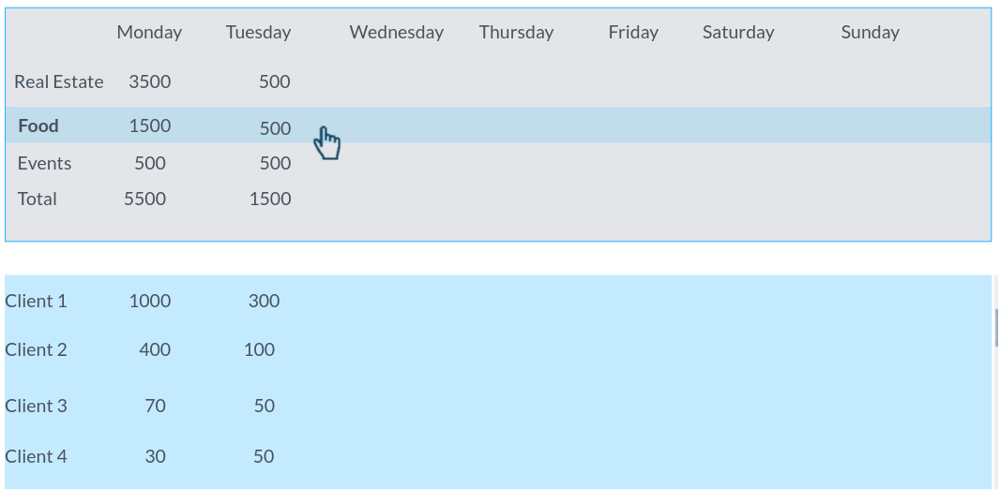
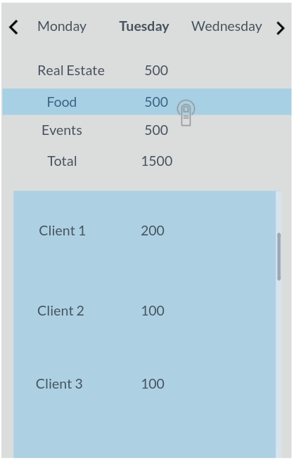

# [boomimagestudio.com](https://boomimagestudio.com/) - Front End test
Welcome!

This test is a part of our hiring process at BOOM for the Front End Developer position. 
You're probably already participating in our hiring process, but if you stumble here by accident, read the document to the end and if you are interested, you can start the process from here.

Despite not having a time limit, we recommend that you don't spend more than 10 to 16 hours working on this challenge. 

We believe that above all a software engineer must be able to create products and this challenge aims exactly at testing that: will you be able to create well-engineered solutions?

## Objective
Build a dashboard to monitor the number of photos we delivered for each day of the week.
It must be possible to show the break down for clients for each day of the week and for each type of photography we do.
You might use pagination or scroll in order to avoid freezing the UI.

## Specs
The dashboard might look like something like this:

Don’t worry too much about the UI because in real-life at BOOM our designers will take care of that, but this is your chance to show off your skills, be creative!

For each day of the week you have to show the total sum of photos that happened that exact weekday. You can get this information by querying our API: https://frontend-test-api-server.herokuapp.com/docs . It is hosted on Heroku so it can take a little the first time you call it.

The solution must be responsive for both Desktop and Mobile.

## Testing
It goes without saying (but we say it), testing is mandatory, pick your favorite framework:) Solutions without tests will not be considered, unit tests are enough, end-to-end are a plus.

## Language & Technologies
We use React & Redux in our platform so if you know those bonus points! Anyways, regardless of the framework you are most experienced with (Vue, Angular, Elm, etc) we are looking for a well-engineered solution in Javascript. We'll be focusing on how you'll organize your components and your style.

## Deliverable 
- A bundled/archived repository showing your commit history or a link to an accessible private repository with your work in (Github can host personal private repositories for free). 
Git example for sending us a standalone bundle:
 `git bundle create <yourname>.bundle --all --branches`
- A README.md file explaining the decisions you've made solving this task including technology and library choices and
any instructions required to run your solution and tests.
- Send everything to umberto.difabrizio@boomimagestudio.com

## Doubts?
Do you have doubts related to the process? Open an issue and we'll be happy to help.
 

That’s it, above all, have fun!

